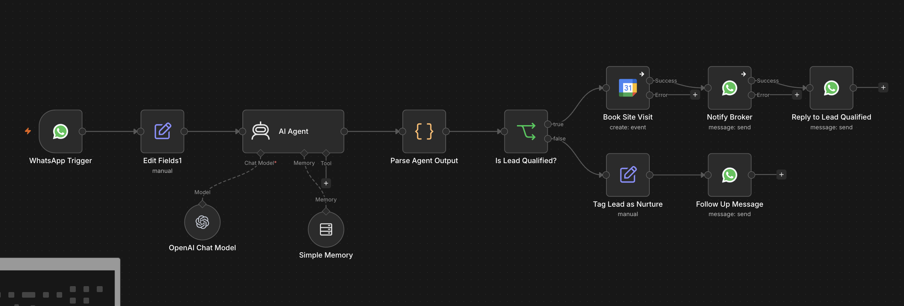

# whatsapp-real-estate-ai-agent

# 🏠 WhatsApp Real Estate AI Agent

An intelligent lead qualification agent built for Pune real estate brokers. Automatically qualifies leads, books site visits, and notifies brokers — all via WhatsApp.

## 🚀 Features
- AI-powered lead qualification via WhatsApp
- Automated conversation in Hinglish
- Google Calendar site visit booking
- Broker notifications on qualified leads
- Session memory for context-aware replies
- Nurture flow for unqualified leads

## 🛠️ Tech Stack
- **n8n** — Workflow automation
- **Meta WhatsApp Business API** — Messaging
- **Google Gemini 2.0 Flash** — AI conversations
- **Google Calendar API** — Site visit booking

## 📸 Workflow

## ⚙️ How It Works
1. Lead messages on WhatsApp
2. Open AI qualifies them (budget, location, timeline)
3. Hot leads → Calendar booking + broker alert
4. Cold leads → Nurture follow-up message

## 🔧 Setup
Import `Real Estate AI agent.json` into your n8n instance and configure credentials.
